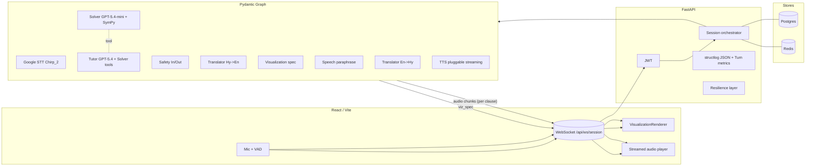

# Teacher Agents

Voice-first, multi-agent Armenian-language math tutor for children aged 5–18.
A child speaks (Armenian) → the system transcribes, reasons, draws a live
visualization, and speaks the response back (Armenian) — all over a single
WebSocket session.

The backend is a Pydantic AI + Pydantic Graph pipeline behind FastAPI; the
frontend is React (Vite). Postgres + Alembic store curriculum + per-child
mastery; Redis stores conversational context. Every external call goes
through a retry + timeout + circuit-breaker layer with multi-model fallback.

---

## Quick start (Docker)

```bash
cp vars/.env.example vars/.env
# Fill in at least OPENAI_API_KEY and GOOGLE_APPLICATION_CREDENTIALS

make up                    # postgres + redis + api + frontend (dev) on :8000 / :5173
make migrate               # alembic upgrade head
make seed                  # seed one math course for the 5-7 age band
```

Open <http://localhost:5173>:

1. Register a parent account.
2. Create a child profile.
3. Click "Start a learning session" → grant mic permission → talk.

The API is also reachable directly at <http://localhost:8000/docs>.

## Quick start (local without Docker)

```bash
uv sync
docker compose up -d postgres redis        # only the data stores
cp vars/.env.example vars/.env             # fill in keys
uv run alembic upgrade head
uv run python -m app.scripts.seed          # optional
uv run python main.py                      # api on :8000
(cd frontend && npm install && npm run dev) # ui on :5173
```

## Architecture



### Per-turn flow

1. Child speaks → audio sent over WS.
2. `STT` (Google Chirp_2, hy-AM) → Armenian text.
3. `Safety In` → moderation gate.
4. `Translator (Hy→En)` — two tracks; math content keeps LaTeX intact.
5. `Tutor` (GPT-5.4) produces a Socratic reply; calls `solver_*` SymPy tools
   to verify every algebraic claim.
6. `Visualization` agent emits a typed `VisualizationSpec` JSON — pushed to
   the client **before** any audio, with an optional `frames` timeline
   for animation synced to TTS start.
7. `Speech` agent splits the reply into clauses for TTS-friendliness.
8. `Translator (En→Hy)` per clause.
9. `Safety Out`.
10. `TTS` (default OpenAI `gpt-4o-mini-tts`, pluggable) streams each clause
    as `{type:'audio', seq, bytes}` over the same WS so the child hears
    the first words in ~300–500 ms.
11. Server persists a `Turn` row with the full latency / token / cost /
    fallback breakdown and updates Redis context.

## Agents

| Agent | Default model | Why this model |
|---|---|---|
| Tutor (Socratic) | `openai:gpt-5.4` | Child-facing reasoning; needs Socratic depth. Per-turn output is short so cost is low in absolute terms. |
| Solver (CAS) | `openai:gpt-5.4-mini` (reasoning=high) | SymPy verifies every claim — mini is enough. ~6× cheaper than flagship. |
| Curriculum Manager | `openai:gpt-5.4-mini` | Structured decision; light reasoning suffices. |
| Assessment | `openai:gpt-5.4-mini` | Quiz generation + grading with strict JSON. |
| Visualization | `openai:gpt-5.4-mini` | Typed JSON output + spatial reasoning. |
| Translator (prose) | `openai:gpt-4o-mini` | Cheapest reliable multilingual; good Armenian. |
| Translator (math-aware) | `openai:gpt-5.4-mini` | Keeps LaTeX/SymPy byte-identical via placeholder masking. |
| Speech (paraphrase) | `openai:gpt-4o-mini` | Cheap rewrite for TTS-friendly clauses. |
| Safety | `omni-moderation-latest` + `gpt-4o-mini` | Free moderation API first; LLM only on ambiguous cases. |
| Context summarizer | `openai:gpt-4o-mini` | Cheap summarization when window grows. |

Every `*_MODEL` env var accepts a comma-separated chain (`primary,fallback1,
fallback2`). On 429 / 5xx / timeout the resilience layer rotates through the
chain and records each hop in the `Turn.fallbacks` JSON column.

### Swapping providers

- **TTS** — set `TTS_PROVIDER=openai|azure|elevenlabs|google` (default
  `openai`). Azure ships native Armenian voices (`hy-AM-AnahitNeural`,
  `hy-AM-HaykNeural`); Google TTS does NOT support Armenian today.
- **STT** — Google v2 (Chirp_2) is currently the only implementation.
- **LLM** — change the relevant `*_MODEL` env var (any Pydantic AI model
  string works: `openai:`, `google-gla:`, `anthropic:`, etc.).

## Visualizations

Backend emits a discriminated `VisualizationSpec` JSON; the frontend renders
each `kind` with a dedicated component:

- `number_line` (SVG)
- `fraction_pie` (SVG)
- `equation_steps` (KaTeX, step-revealed via `frames` timeline)
- `function_plot` (JSXGraph)
- `geometry` (JSXGraph constructions)
- `bar_chart` (SVG)
- `animation_timeline` (SVG canvas + ops timeline)

Any kind may carry an optional `frames: [{t_ms, ops}]` timeline. The client
arms the timeline at TTS start so animations stay in sync with the spoken
explanation.

## Observability

- **structlog JSON** logs to stdout with a stable schema: `ts`, `level`,
  `event`, `service`, `env`, `request_id`, `session_id`, `child_id`,
  `parent_id`, `agent`, `node`, `model`, `provider`, `duration_ms`,
  `tokens_in`, `tokens_out`, `cost_usd_est`.
- **Request-ID propagation** via middleware + WebSocket envelope, carried in
  `contextvars` into every agent / graph node.
- **Turn metrics** persisted on each `Turn` row:
  `stt_ms`, `safety_in_ms`, `translate_in_ms`, `tutor_ms`, `solver_ms`,
  `viz_ms`, `speech_ms`, `translate_out_ms`, `safety_out_ms`,
  `tts_first_byte_ms`, `tts_total_ms`, `e2e_ms`, `tokens_*`, `cost_usd_est`,
  `fallbacks` (JSON array), `agent_path`.
- **Prometheus** exporter at `GET /internal/metrics` (admin auth required):
  per-agent latency histograms, LLM error counters, TTS first-byte
  histogram, BKT updates count, active WS connections.
- **PII redaction**: a structlog processor scrubs emails / phones / names
  from every log record; audio bytes are never logged.

## Resilience

- Tenacity retries with exponential backoff for every upstream call.
- Per-upstream circuit breaker (`openai`, `google_stt`, `google_moderation`,
  TTS providers, etc.) that trips after 5 consecutive failures and cools
  down for 30 s.
- Multi-model fallback chains (see "Swapping providers" above).
- Graceful degradation:
  - STT down → emit `block_reason=stt_unavailable`, prompt child to retry.
  - Tutor down → canned apology reply, viz still attempted.
  - TTS down → text persisted, audio omitted (frontend shows transcript).

## Pedagogy

- Age bands (5–7, 8–11, 12–15, 16–18) drive prompt tone, sentence length,
  preferred visualization kinds, and session length.
- **BKT** (Bayesian Knowledge Tracing) per `Skill` (`p_init`, `p_transit`,
  `p_slip`, `p_guess`) updates after each assessment.
- **Spaced repetition** (SM-2) writes a `ReviewQueueItem` whenever mastery
  dips or a quiz fails; the Curriculum Manager pulls due reviews before
  new content.

## Auth

- Roles: `admin`, `parent`, `child`. Parents register with email/password;
  child sessions use short-lived JWTs issued by the parent through
  `/api/auth/children/{id}/token`. Admins are bootstrapped from
  `CREATE_ADMIN_EMAIL` / `CREATE_ADMIN_PASSWORD`.

## Project layout

```
app/
├── settings.py           # Pydantic Settings, every model name + key via env
├── main.py               # FastAPI app + lifespan
├── core/
│   ├── logging.py        # structlog JSON + PII redaction
│   ├── metrics.py        # TurnMetrics + Prometheus instruments
│   ├── resilience.py     # retry + timeout + circuit breaker + fallback
│   ├── security.py       # JWT + bcrypt
│   ├── context_vars.py   # request_id / session_id / child_id propagation
│   └── bootstrap.py      # admin seeding
├── db/
│   ├── base.py session.py
│   └── models/{user,content,progress}.py
├── api/
│   ├── deps.py middleware.py schemas.py
│   ├── auth.py admin.py parent.py progress.py ws.py metrics.py
├── services/
│   ├── stt/google.py
│   ├── tts/{openai,azure,elevenlabs,google}_tts.py
│   ├── context/redis_context.py
│   └── cas/sympy_cas.py
├── agents/
│   ├── base.py prompt_loader.py
│   ├── translator.py safety.py curriculum.py
│   ├── tutor.py solver.py assessment.py
│   ├── speech.py visualization.py summarizer.py
│   └── prompts/*.md
├── graph/
│   ├── state.py nodes.py graph.py
├── viz/schema.py
├── learning/{bkt,spaced_repetition}.py
└── scripts/seed.py

frontend/src/
├── App.jsx App.css main.jsx RouteGuards.jsx
├── lib/{api,ws,store}.js
├── auth/{Login,ParentSignup,ChildPicker}.jsx
├── chat/VoiceChat.jsx
├── viz/VisualizationRenderer.jsx
├── viz/renderers/{NumberLine,FractionPie,EquationSteps,FunctionPlot,Geometry,BarChart,AnimationTimeline}.jsx
├── admin/{AdminLayout,CrudTable,pages}.jsx
└── parent/Dashboard.jsx

alembic/                  # async migrations
docker-compose.yml        # api + frontend + postgres + redis + alembic profile
Dockerfile                # api image
frontend/Dockerfile       # dev (vite) + prod (nginx) stages
Makefile                  # up/down/migrate/seed/lint/test/fmt
scripts/check.sh          # ruff + format --check + mypy + pytest
vars/.env.example         # every env variable documented
```

## Development

```bash
make sync            # uv sync
make lint            # ruff check + mypy
make fmt             # ruff format + ruff fix
make test            # pytest
make check           # lint + test
./scripts/check.sh   # full CI bundle
```

## Roadmap (planned extensions)

- Manim-web animations for richer visuals.
- Parent weekly email summaries.
- Multi-subject support (science, language).
- Mobile PWA polish, offline mode for STT review.
- A/B prompt experiments.
